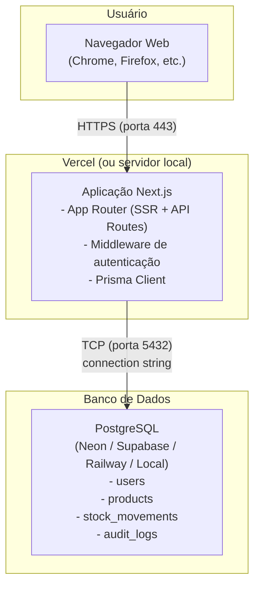

# Diagrama de Implantação — Estoque+

## Visão geral

O sistema segue uma arquitetura cliente-servidor simples, compatível com deploy na Vercel e banco PostgreSQL hospedado em serviço externo.

## Diagrama

## Componentes

### Navegador do usuário
- Acessa o sistema via HTTPS
- Interface renderizada pelo Next.js (SSR + Client Components)
- Sessão mantida via cookie httpOnly com token JWT

### Aplicação Next.js (Vercel)
- **Server-Side Rendering (SSR):** páginas são renderizadas no servidor com verificação de autenticação
- **API Routes:** endpoints REST para operações de dados
- **Middleware:** intercepta requisições para validar token JWT e proteger rotas
- **Prisma Client:** ORM que conecta ao PostgreSQL

### PostgreSQL
- Banco relacional com 4 tabelas principais: users, products, stock_movements, audit_logs
- Pode ser hospedado em qualquer serviço compatível (Neon, Supabase, Railway, etc.)
- Conexão via string `DATABASE_URL` configurada em variável de ambiente

## Fluxo de comunicação

1. Usuário acessa o sistema pelo navegador (HTTPS)
2. Middleware do Next.js verifica o cookie de autenticação
3. Se autenticado, a página é renderizada no servidor com dados do banco
4. Interações do usuário (formulários, ações) enviam requisições para as API Routes
5. API Routes usam o Prisma Client para ler/escrever no PostgreSQL
6. Respostas voltam ao navegador com feedback visual

## Ambientes compatíveis

| Componente | Desenvolvimento | Produção |
|-----------|----------------|----------|
| Aplicação | `localhost:3000` | Vercel |
| Banco | PostgreSQL local | Neon, Supabase, Railway |
| Protocolo | HTTP | HTTPS |
